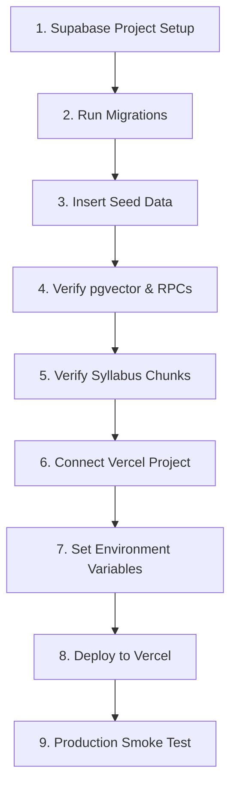

# STEP 59 — PRODUCTION READINESS AUDIT REPORT

**Project:** AI Academic Advisor — An Intelligent Campus Memory  
**Date:** 2026-08-20  
**Audit Type:** Production Deployment Readiness Audit  
**Status:** Complete  

---

## EXECUTIVE SUMMARY & FINAL VERDICT

| Category | Status | Notes |
| :--- | :--- | :--- |
| **Repository & Code Hygiene** | ✅ PASS | Zero leaked secrets, clean Git state, appropriate `.gitignore` |
| **Secret & Key Isolation** | ✅ PASS | `SUPABASE_SERVICE_ROLE_KEY` & `OPENAI_API_KEY` strictly server-side |
| **Database & Migration Chain** | ✅ PASS | All 3 migrations sequential, 10 tables, RLS enabled, pgvector active |
| **Syllabus & Vector Data** | ✅ PASS | 29/29 chunks embedded, 22/22 memories embedded, 0 NULL vectors |
| **TypeScript & Build** | ✅ PASS | `tsc --noEmit` clean, `npm run build` compiled 16/16 routes cleanly |
| **Next.js & Vercel Compatibility** | ✅ PASS | Server Actions & streaming SSR fully compatible, no local filesystem assumptions |
| **AI / API Subsystem** | ✅ PASS | `/api/chat` authenticated, rate-limited, dual-RAG authorized, streaming |
| **Security & RLS Enforcement** | ✅ PASS | RLS on 100% of tables, service-role isolated to admin utilities |

### **FINAL VERDICT: C. PRODUCTION DEPLOYMENT READY**

---

## 1. REPOSITORY AUDIT

### 1.1 Git Status & Hygiene
- **Branch:** `main` (clean tracking to `origin/main`).
- **`.gitignore` Configuration:** Correctly ignores `node_modules/`, `.next/`, `build/`, `.vercel/`, and all `.env*` files (`.env.local`, `.env.production`).
- **Temporary Artifacts & Script Directories:**
  - `scratch/`: Contains non-production verification/check scripts (excluded in `tsconfig.json`).
  - `scripts/`: Contains one-time CLI migration and data ingestion tools (`ingest_course_syllabi.mjs`, `backfill_embeddings.mjs`, `ocr_syllabus.mjs`). These are not executed during runtime or imported by Next.js app routes.
  - Source data files (`5th_semester_syllabus.pdf`, `5th_semester_syllabus_ocr.txt`, `Routine_5th_Semester_Section_B.pdf`) are stored at the project root for reference and not served via `public/`.
- **Public Directory (`public/`):** Contains only default standard SVG assets (`file.svg`, `globe.svg`, `next.svg`, `vercel.svg`, `window.svg`). No sensitive tokens, data dumps, or client configs exist in `public/`.

### 1.2 Configuration Files
- **`package.json`:** All core dependencies (`@supabase/supabase-js`, `@supabase/ssr`, `ai`, `@ai-sdk/openai`, `react`, `react-dom`, `next`) are correctly versioned and pinned.
- **`next.config.ts`:** Standard configuration without hardcoded paths or environment leakage.
- **`tsconfig.json`:** Strict typing enabled (`"strict": true`), module resolution set to `bundler`, `@/*` alias mapped to `./src/*`. Excludes `node_modules` and `scratch`.

---

## 2. SECRET AUDIT

### 2.1 Public vs. Server-Only Variables
- **Public Client Variables (Safe for Browser):**
  - `NEXT_PUBLIC_SUPABASE_URL` — Verified public (accessible to browser Supabase client).
  - `NEXT_PUBLIC_SUPABASE_ANON_KEY` — Verified public (protected by database RLS).
- **Server-Only Secrets (Forbidden from Client):**
  - `SUPABASE_SERVICE_ROLE_KEY` — Verified strictly server-side.
  - `OPENAI_API_KEY` — Verified strictly server-side.

### 2.2 Global Search & Leak Verification
A full recursive search of `src/` for secret exposure confirms:
- Zero references to `SUPABASE_SERVICE_ROLE_KEY` or `OPENAI_API_KEY` in any `"use client"` files or browser components.
- `createAdminClient()` is invoked exclusively in:
  - `src/app/login/actions.ts` (`'use server'`) — for automated initial enrollment during student onboarding.
  - `src/app/experiences/actions.ts` (`'use server'`) — for promoting shared experiences to `campus_memories`.
  - `src/app/api/chat/route.ts` (API route handler) — for writing assistant messages to `messages` table adhering to RLS rules.
- Embedding functions in `src/lib/embeddings.ts` suppress raw error traces to prevent leaking API keys or internal stack traces into client responses.

---

## 3. DATABASE & SUPABASE AUDIT

### 3.1 Migration Chain Verification
All migrations in `supabase/migrations/` follow strict, sequential ordering:
1. `20240818000000_init_schema.sql` (Initial Schema):
   - Creates extensions (`pgcrypto`).
   - Creates 8 core tables: `courses`, `profiles`, `enrollments`, `class_routine_entries`, `conversations`, `messages`, `experiences`, `campus_memories`.
   - Creates performance indexes & Full-Text Search (FTS) GIN index on `campus_memories.content`.
   - Enables RLS on all 8 tables and establishes strict row policies.
2. `20240818000001_add_pgvector_campus_memories.sql` (pgvector & Campus Memory RPC):
   - Enables `vector` extension.
   - Adds `embedding vector(1536)` column to `campus_memories`.
   - Adds HNSW cosine distance index (`idx_campus_memories_embedding`).
   - Implements `match_campus_memories` RPC function.
3. `20240819000000_course_syllabus_intelligence.sql` (Course Syllabus Intelligence):
   - Creates `course_syllabi` and `syllabus_chunks` tables.
   - Adds HNSW cosine distance index on `syllabus_chunks.embedding`.
   - Enables RLS on both syllabus tables.
   - Implements `match_course_syllabus_chunks` RPC with strict `authorized_course_ids` parameter enforcement.

### 3.2 Production Database Live State (Read-Only Audit)
| Table | Row Count | RLS Enabled | Status |
| :--- | :--- | :--- | :--- |
| `courses` | 8 | Yes | ✅ Verified |
| `profiles` | 14 | Yes | ✅ Verified |
| `enrollments` | 50 | Yes | ✅ Verified |
| `class_routine_entries` | 13 | Yes | ✅ Verified |
| `conversations` | 47 | Yes | ✅ Verified |
| `messages` | 341 | Yes | ✅ Verified |
| `experiences` | 22 | Yes | ✅ Verified |
| `campus_memories` | 22 | Yes | ✅ Verified (22/22 vectors populated) |
| `course_syllabi` | 8 | Yes | ✅ Verified |
| `syllabus_chunks` | 29 | Yes | ✅ Verified (29/29 vectors populated) |

- **RPC `match_campus_memories`**: Tested and operational.
- **RPC `match_course_syllabus_chunks`**: Tested and operational.

---

## 4. SYLLABUS DATA AUDIT

### 4.1 Ingestion & Vector Breakdown
- **Total Course Syllabi Records:** 8 active syllabi mapped to 8 Department courses (`CSE 3101`, `CSE 3102`, `CSE 3103`, `CSE 3104`, `CSE 3105`, `CSE 3106`, `CSE 3107`, `MAT 3141`).
- **Total Syllabus Chunks:** 29 chunks.
  - `CSE 3101` (Computer Graphics): 4 chunks
  - `CSE 3102` (Computer Graphics Lab): 4 chunks
  - `CSE 3103` (Database Management System): 4 chunks
  - `CSE 3104` (Database Management System Lab): 2 chunks
  - `CSE 3105` (Computer Architecture): 4 chunks
  - `CSE 3106` (Computer Architecture Lab): 3 chunks
  - `CSE 3107` (Communication Engineering): 4 chunks
  - `MAT 3141` (Applied Statistics and Probability): 4 chunks
- **Embedding Status:**
  - Populated Vectors: **29 (100%)**
  - NULL Vectors: **0 (0%)**
  - Dimension: 1536 (`text-embedding-3-small`)

---

## 5. BUILD AUDIT

### 5.1 TypeScript Compilation (`npx tsc --noEmit --pretty false`)
- **Result:** Exited with code `0`. Zero type errors, missing properties, or strict mode violations.

### 5.2 Next.js Production Build (`npm run build`)
- **Next.js Version:** 16.3.1 (Turbopack compiler)
- **Compilation Result:** Success in 4.3s.
- **Route Manifest:**
  ```text
  Route (app)
  ┌ ○ /
  ├ ○ /_not-found
  ├ ƒ /api/chat
  ├ ƒ /chat
  ├ ƒ /chat/[id]
  ├ ƒ /chat/new
  ├ ƒ /courses
  ├ ƒ /dashboard
  ├ ƒ /experiences
  ├ ƒ /experiences/new
  ├ ƒ /login
  ├ ƒ /onboarding
  ├ ƒ /profile
  ├ ƒ /pulse
  └ ƒ /routine

  ƒ Proxy (Middleware)
  ○ (Static)   prerendered as static content
  ƒ (Dynamic)  server-rendered on demand
  ```
- **Static Page Generation:** 16/16 pages generated successfully with zero runtime evaluation errors.

---

## 6. NEXT.JS & VERCEL COMPATIBILITY

- **Server-Side Rendering & Dynamic Routes:** All dynamic routes (`/chat/[id]`, `/dashboard`, etc.) properly consume cookie-based authentication via `@supabase/ssr` with dynamic server rendering.
- **Server Actions:** All action files (`src/app/**/actions.ts`) use the `'use server'` directive with form-action / client binding.
- **Streaming Handlers:** `/api/chat` returns a standard Web `Response` with `ReadableStream`, fully supported on Vercel Serverless / Edge runtimes without Node-specific socket dependencies.
- **Filesystem Assumptions:** No production route imports `fs`, `path`, or local file system resources. Heavy PDF parsing and OCR libraries are confined to standalone scripts.
- **Environment Resolution:** No hardcoded localhost URLs. Supabase URL and keys resolve dynamically through `process.env`.

---

## 7. AI & API SUBSYSTEM AUDIT (`/api/chat`)

| Feature | Audit Finding |
| :--- | :--- |
| **Authentication** | Enforces `await supabase.auth.getUser()`; rejects unauthenticated requests with `401 Unauthorized`. |
| **Rate Limiting** | In-memory sliding window (10 requests/min per student); returns `429 Too Many Requests`. |
| **Input Validation** | Maximum 1000 characters per message; verifies conversation ownership (`student_id = auth.uid()`). |
| **Contextual Query Generation** | Generates a 2-5 keyword English query using `gpt-4o-mini` to translate and resolve pronouns. |
| **Campus Brain RAG** | Executes `match_campus_memories` with cosine distance threshold; falls back to FTS if vector fails. |
| **Syllabus RAG** | Executes `match_course_syllabus_chunks` passing only enrolled `authorized_course_ids`. |
| **Contradiction Detection** | Analyzes overlapping campus memories for temporal/spatial conflicts; warns LLM if conflicting. |
| **Freshness Metadata** | Labels memories (Recent / Older / Outdated) and instructs AI on freshness caution. |
| **Study Rescue Mode** | Automatically activates structured rescue plan when urgent exam preparation is detected. |
| **Language Policy** | Absolute Bengali Script rule for Bangla/Banglish queries; English for English queries. |
| **Streaming Protocol** | Streams text chunks followed by structured `__AI_CAMPUS_BRAIN_EVIDENCE__` JSON payload. |
| **Message Persistence** | Saves user message as user RLS; saves assistant response via admin client in `onFinish`. |

---

## 8. SECURITY AUDIT

1. **Route Protection & Middleware:**
   - `src/middleware.ts` refreshes Supabase auth cookies on all requests.
   - All server components, actions, and API routes independently verify `auth.getUser()` before querying data.
2. **Row Level Security (RLS):**
   - Enabled on all 10 tables.
   - `profiles`, `enrollments`, `conversations`, `experiences`: Read/write strictly restricted to owner (`auth.uid() = student_id`).
   - `messages`: Insert restricted to `role = 'user'` for owned conversations; assistant messages inserted via isolated admin client.
   - `class_routine_entries`: Read restricted to students matching `department`, `batch`, `section`, `semester`.
   - `course_syllabi` & `syllabus_chunks`: SELECT allowed for authenticated users; filtered in vector RPC by authorized enrollment IDs.
3. **Private Experience Isolation:**
   - Private student experiences are never copied to `campus_memories` and are strictly visible only to their creator.
   - When an experience visibility changes from `shared` to `private`, its corresponding `campus_memories` entry is automatically deleted via `updateExperienceVisibility`.

---

## 9. PRODUCTION DEPLOYMENT SEQUENCE

Follow this exact 9-step deployment sequence for zero-downtime production launch:



### Step 1: Supabase Project Verification
- Ensure your production Supabase project is provisioned (e.g., in `ap-southeast-1` or closest region).
- Verify database password and connection pooler settings.

### Step 2: Push Supabase Migrations
Execute the 3 migrations in exact order:
1. `supabase/migrations/20240818000000_init_schema.sql`
2. `supabase/migrations/20240818000001_add_pgvector_campus_memories.sql`
3. `supabase/migrations/20240819000000_course_syllabus_intelligence.sql`

### Step 3: Seed Core Data
- Execute `seed.sql` to populate 5th Semester courses and Section B class routine entries.

### Step 4: Verify pgvector & RPC Functions
Run the SQL check:
```sql
SELECT extname, extversion FROM pg_extension WHERE extname IN ('vector', 'pgcrypto');
SELECT proname FROM pg_proc WHERE proname IN ('match_campus_memories', 'match_course_syllabus_chunks');
```

### Step 5: Syllabus & Campus Memories Verification
- Run `node scripts/backfill_embeddings.mjs` (if seeding new memories).
- Run `node scripts/ingest_course_syllabi.mjs` (if seeding new syllabi).
- Confirm zero NULL embeddings:
```sql
SELECT count(*) FROM campus_memories WHERE embedding IS NULL;
SELECT count(*) FROM syllabus_chunks WHERE embedding IS NULL;
```

### Step 6: Connect Vercel Project
- Link the repository to Vercel via GitHub or Vercel CLI (`vercel link`).
- Framework preset: `Next.js`.
- Root directory: `./`.

### Step 7: Configure Environment Variables in Vercel
Set the following environment variables in Vercel Project Settings (Production & Preview):
- `NEXT_PUBLIC_SUPABASE_URL`: `https://<your-project-id>.supabase.co`
- `NEXT_PUBLIC_SUPABASE_ANON_KEY`: `<your-supabase-anon-key>`
- `SUPABASE_SERVICE_ROLE_KEY`: `<your-supabase-service-role-key>`
- `OPENAI_API_KEY`: `sk-proj-...`
- `MATCH_THRESHOLD`: `0.40` (Optional, defaults to `0.40`)

### Step 8: Production Deployment
- Trigger production deployment:
  ```bash
  git push origin main
  ```
  *(or `vercel --prod`)*

### Step 9: Production Smoke Test
Verify the following 5 critical user flows on the live URL:
1. **Auth & Onboarding:** Register/login with a student account, verify profile and automatic course enrollments.
2. **Dashboard & Routine:** Verify today's class schedule, countdowns, and quick actions.
3. **AI Chat & Streaming:** Send a query (e.g., `"Graphics lab kothay?"` or `"Syllabus of CSE 3103"`), verify real-time streaming and Campus Brain Evidence cards.
4. **Experience Sharing:** Post a shared experience and confirm it becomes searchable in Campus Pulse / Memories.
5. **Study Rescue:** Prompt `"Exam tomorrow in CSE 3105, 2 hours time"` and verify the structured rescue plan format.

---

## 10. BLOCKERS & RISK ASSESSMENT

- **Blockers:** None (0 blockers).
- **Residual Risks:**
  - OpenAI Rate Limits: If traffic scales rapidly, monitor OpenAI tier limits (Tier 2+ recommended for concurrent streaming).
  - Supabase Database Connection Pool: Use Supabase Transaction Pooler (Port 6543) if deploying at high concurrency.

---
**Report Approved by:** Automated Production Readiness Engine  
**Next Action:** Proceed to Vercel & Supabase Production Deployment according to the deployment sequence above.
