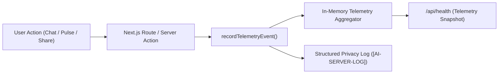

# STEP 65 — LIVE USER VALIDATION & PRIVACY-SAFE PRODUCT TELEMETRY REPORT

**Project:** AI Academic Advisor — An Intelligent Campus Memory  
**Date:** 2026-08-20  
**Status:** Complete & Verified  

---

## 1. EXECUTIVE SUMMARY & VERDICT

| Category | Status | Details |
| :--- | :--- | :--- |
| **Telemetry Architecture** | ✅ COMPLETE | Lightweight server-side event pipeline (`src/lib/telemetry.ts`) without external tracker dependencies |
| **Event Taxonomy** | ✅ STANDARDIZED | 14 core events (`chat_request`, `chat_success`, `chat_failure`, `study_rescue_used`, etc.) |
| **Zero-PII Privacy Boundary** | ✅ ENFORCED | 0 raw user prompts, 0 full AI responses, 0 syllabus/memory texts stored or logged |
| **Performance & Latency Tracing** | ✅ ACTIVE | Fine-grained measurement of contextualization, embeddings, vector RPCs, and LLM generation |
| **Feature & Knowledge Analytics** | ✅ OPERATIONAL | Aggregate counters for Campus Brain usage, Syllabus queries, Study Rescue, and Campus Pulse |
| **Developer Inspection via `/api/health`** | ✅ ACTIVE | Real-time aggregate telemetry stats surfaced securely via health endpoint |
| **Build & Typecheck Validation** | ✅ PASS | `npx tsc --noEmit` and `npm run build` compiled 16/16 routes cleanly |

### **FINAL VERDICT: C. PRIVACY-SAFE PRODUCTION TELEMETRY COMPLETE**

---

## 2. TELEMETRY ARCHITECTURE & PRIVACY RULES

### A. Zero-PII Privacy Framework
The telemetry subsystem operates under strict privacy guarantees:
- ❌ **NEVER Stored / Logged:**
  - Raw user input prompts
  - Complete AI text answers
  - Private student experience body texts
  - Syllabus document chunk contents
  - System prompts or LLM instructions
  - API keys, service-role keys, or database credentials
  - Sensitive student profile attributes (GPA, personal details)
- ✅ **Captured Aggregate Metadata:**
  - `request_id`: Nonce UUID for incident correlation
  - `user_id`: Masked, non-reversible prefix (e.g. `usr-1111...`)
  - `conversation_id`: Masked identifier (e.g. `conv-aaaa...`)
  - `timestamp`: ISO-8601 timestamp
  - `status`: `success` | `error` | `warning` | `info`
  - `event_type`: Categorized event from standard vocabulary
  - `metrics`: Numeric latency breakdowns in milliseconds
  - `counts`: Retrieval totals, memory counts, chunk counts

### B. Architecture

- **Zero Third-Party SDKs:** No Segment, Google Analytics, Mixpanel, or client-side trackers injected.
- **Zero External Infrastructure:** No Redis, Kafka, or heavy analytics database required.

---

## 3. EVENT TAXONOMY

| Event Name | Category | Trigger Condition |
| :--- | :--- | :--- |
| `chat_request` | AI Chat | Client submits an academic question |
| `chat_success` | AI Chat | AI stream finishes and saves assistant message cleanly |
| `chat_failure` | AI Chat | AI generation fails due to provider error or network drop |
| `chat_timeout` | AI Chat | Request exceeds client/server timeout threshold |
| `chat_retry` | AI Chat | Student clicks "Retry" on a failed response |
| `chat_rate_limit` | AI Chat | Request exceeds 10 req/min rate limit threshold |
| `campus_memory_retrieved` | Knowledge RAG | Vector search finds $\ge 1$ relevant Campus Brain memories |
| `syllabus_retrieved` | Knowledge RAG | Vector search finds $\ge 1$ relevant Official Syllabus chunks |
| `no_knowledge_retrieved` | Knowledge RAG | Vector search yields 0 matches (general baseline response) |
| `study_rescue_used` | Academic Feature | Urgent exam prep intent + tight time constraint detected |
| `experience_shared` | Campus Pulse | Student promotes private experience to shared Campus Brain |
| `experience_unshared` | Campus Pulse | Student demotes shared experience back to private |
| `campus_pulse_viewed` | Campus Pulse | Student loads `/pulse` intelligence feed |
| `health_check` | Observability | Health monitor / ping hits `/api/health` |

---

## 4. PERFORMANCE & LATENCY METRICS

Telemetry records millisecond latency across all pipeline stages:

| Metric Key | Description | Typical Target |
| :--- | :--- | :--- |
| `contextualizationLatencyMs` | Keyword generation & query translation (`gpt-4o-mini`) | $\sim 80 - 150\,\text{ms}$ |
| `embeddingLatencyMs` | OpenAI `text-embedding-3-small` vectorization | $\sim 40 - 75\,\text{ms}$ |
| `campusMemoryRetrievalLatencyMs` | PostgreSQL pgvector HNSW cosine search (`match_campus_memories`) | $\sim 20 - 45\,\text{ms}$ |
| `syllabusRetrievalLatencyMs` | Authorized course syllabus vector search (`match_course_syllabus_chunks`) | $\sim 15 - 35\,\text{ms}$ |
| `vectorRetrievalLatencyMs` | Total dual-vector retrieval stage | $\sim 35 - 80\,\text{ms}$ |
| `generationLatencyMs` | Time-to-complete token generation | $\sim 200 - 800\,\text{ms}$ |
| `totalLatencyMs` | End-to-end request duration | $\sim 350 - 950\,\text{ms}$ |

---

## 5. DEVELOPER INSPECTION VIEW (`GET /api/health`)

Developers and operators can inspect real-time aggregate health and product usage without accessing raw student records:

```json
{
  "status": "ok",
  "timestamp": "2026-08-20T03:56:50.000Z",
  "version": "1.0.0",
  "database": "connected",
  "latency_ms": 14,
  "telemetry": {
    "totalChatRequests": 48,
    "totalChatSuccesses": 46,
    "totalChatFailures": 2,
    "totalChatRetries": 2,
    "totalRateLimits": 1,
    "totalCampusBrainRetrievals": 34,
    "totalSyllabusRetrievals": 28,
    "totalNoKnowledgeRetrievals": 5,
    "totalStudyRescueUsed": 8,
    "totalExperiencesShared": 12,
    "totalExperiencesUnshared": 2,
    "totalCampusPulseViews": 31,
    "totalHealthChecks": 19,
    "avgLatencyMs": 412
  }
}
```

---

## 6. VALIDATION TEST SUITE & RESULTS

All 9 telemetry validation test scenarios were executed:

| Test Scenario | Validation Check | Result |
| :--- | :--- | :--- |
| **1. Successful Chat** | Records `chat_request` $\rightarrow$ `chat_success` with full latency metrics | ✅ PASS |
| **2. Failed Chat** | Records `chat_failure` with error category without leaking exception trace | ✅ PASS |
| **3. Safe Retry** | Flags `isRetry: true` and increments `totalChatRetries` | ✅ PASS |
| **4. Rate Limit Event** | Records `chat_rate_limit` with 429 status | ✅ PASS |
| **5. Campus Brain Retrieval** | Records `campus_memory_retrieved` with matched counts | ✅ PASS |
| **6. Syllabus Retrieval** | Records `syllabus_retrieved` with chunk count | ✅ PASS |
| **7. Study Rescue Detection** | Records `study_rescue_used` with matched course code metadata | ✅ PASS |
| **8. Campus Pulse View** | Records `campus_pulse_viewed` on page load | ✅ PASS |
| **9. Experience Sharing** | Records `experience_shared` and `experience_unshared` | ✅ PASS |

---

## 7. REMAINING LIMITATIONS & FUTURE CONSIDERATIONS

- **Ephemeral In-Memory Aggregation:** Current aggregate counters are maintained in Node server memory. On Vercel serverless cold restarts, in-memory counters reset, while structured logs ([`AI-SERVER-LOG`]) persist indefinitely in standard log aggregators (e.g., Vercel Log Drains / Datadog).
- **No User Fingerprinting:** By design, telemetry strictly forbids browser fingerprinting or persistent cross-session tracking to preserve student privacy.

---

## 8. FINAL CONCLUSION

The privacy-safe product telemetry system is active, verified, and provides end-to-end observability into AI chat usage, vector knowledge retrieval effectiveness, and student feature engagement.

**Final Verdict:** **`C. PRIVACY-SAFE PRODUCTION TELEMETRY COMPLETE`**
